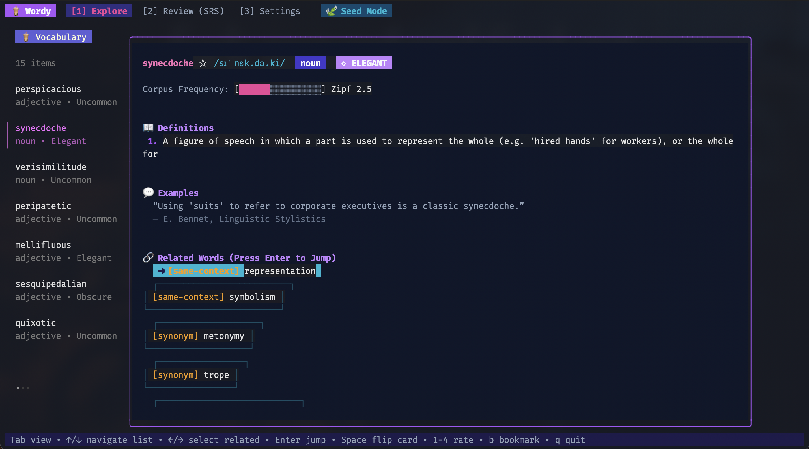

# 🧋 Wordy

> A **Bubble Tea** & **Lip Gloss** powered TUI that teaches less common but highly useful English vocabulary using **Wordnik API** frequency metrics, linked word networks, and **Spaced Repetition (SM-2)**.




---

## ✨ Features

- ◈ **Frequency & Rarity Meter**: Scores word usage frequency (Zipf scale & corpus counts) into 4 curated tiers (*Uncommon*, *Elegant*, *Obscure*, *Rare*).
- 🔗 **Linked Related Word Network**: Explore synonyms, antonyms, and hypernyms. Press `Enter` on any related word to instantly jump to it.
- 📇 **Spaced Repetition System (SM-2)**: Interactive flashcards tracking recall quality (1-4), review intervals, ease factors, streaks, and due queues.
- 📜 **Height-Bounded Viewport**: Content dynamically scales and scrolls inside a Lip Gloss viewport so it never overflows terminal window height.
- ⚡ **Resilient Wordnik Integration**:
  - Monitors rate-limit response headers (`x-ratelimit-remaining-hour`, `x-ratelimit-remaining-minute`).
  - Automatic fallback to high-quality offline seed dataset when no API key is set.
  - Persistent disk caching (`~/.cache/wordy/`) to conserve API requests.

---

## 🚀 Quick Start

### Installation

```bash
# Clone the repository
git clone https://github.com/wordy-tui/wordy.git
cd wordy

# Build and run
go build -o wordy main.go
./wordy
```

---

## 🔑 Setting up Wordnik API (Optional)

Wordy works out of the box in **Offline Seed Mode**. To query live Wordnik data:

1. Obtain a Wordnik API key at [developer.wordnik.com](https://developer.wordnik.com/).
2. Export your key in your environment or enter it in the **Settings [3]** tab:

```bash
export WORDNIK_API_KEY="your_api_key_here"
./wordy
```

---

## ⌨️ Keybindings

| Key | Action |
| :--- | :--- |
| `Tab` / `Shift+Tab` | Switch tabs (*[1] Explore* / *[2] Review (SRS)* / *[3] Settings*) |
| `1` - `4` | Switch tab or rate flashcard recall (*1: Again, 2: Hard, 3: Good, 4: Easy*) |
| `↑` / `↓` | Select word from sidebar list or scroll content viewport |
| `←` / `→` | Navigate related word pills |
| `Enter` | Jump to selected related word |
| `Backspace` | Return to previous word in exploration history |
| `Space` | Flip flashcard in Review mode |
| `b` | Toggle bookmark on active word |
| `q` / `Ctrl+C` | Quit Wordy |

---

## 📜 License

MIT © Wordy Contributors
